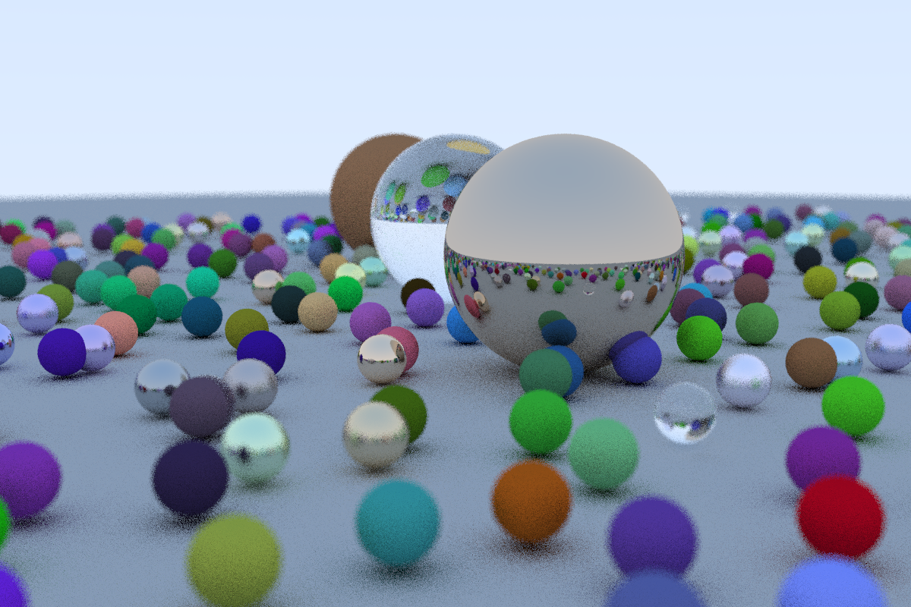
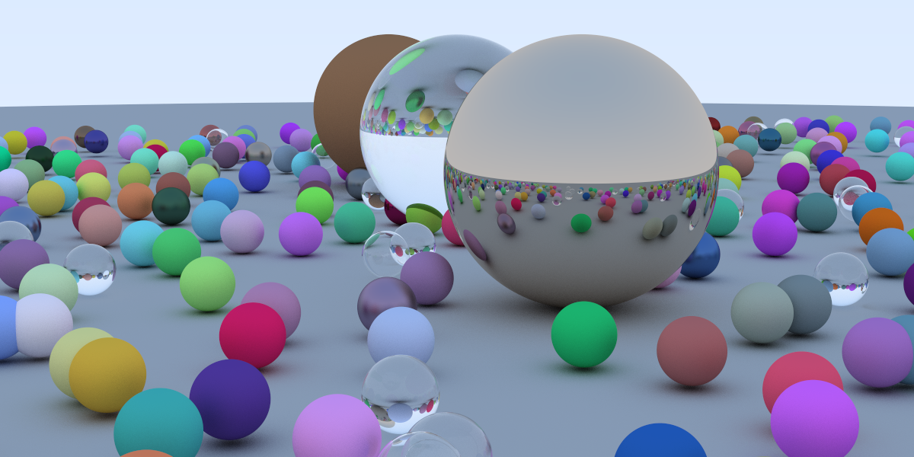

Implementations in C++ (CPU), CUDA C++ (GPU), and OptiX (GPU SDK). Started with v2 in C++ from Peter Shirley's [Ray Tracing In One Weekend](https://github.com/RayTracing/raytracing.github.io) Book Series.

-	Multi-platform CMake builds (C++ tested on Linux, macOS)
-	CUDA C++ and Optix 6.5 tested on Ubuntu 19.10

Image Renders (C++ Single Thread CPU)
-------------------------------------

### In One Weekend


1200x800 pixels, 20 rays per pixel. Image took about 12.3 minutes, without BVH partitioning. When generating same scene with BVH, took about 3 minutes.

### The Next Week


1000x1000 pixels with 2500 rays per pixel. took over 18 hours

### Rest Of Life

Top Image above: 1000x1000 pixels with 500 rays per pixel. took 1 hour, 8 minutes

Build C++ (Cpp)
---------------

-	Using `cmake`
-	Source code needs c++11 compatible compiler (e.g., g++-8, g++-9, clang)

```bash
cmake -B build   # create build dir and generate
cmake --build build   # build all targets
```

-	specify the target with the `--target <program>` option

	```
	cmake --build build --target inOneWeekendCpp
	cmake --build build --target theNextWeekCpp
	cmake --build build --target restOfLifeCpp
	```

Use `cmake -DCMAKE_EXPORT_COMPILE_COMMANDS=ON` so that emacs irony-mode can know the compiler flags and flycheck can work.

Build CUDA
----------

Code based on https://github.com/rogerallen/raytracinginoneweekendincuda

```
cmake -DCMAKE_EXPORT_COMPILE_COMMANDS=ON  -B build

# target specific SM
cmake -DCMAKE_EXPORT_COMPILE_COMMANDS=ON \
      -DCMAKE_CUDA_FLAGS="-arch=sm_75" -B build
```

the CUDA targets

```
cmake --build build --target inOneWeekendCuda
cmake --build build --target theNextWeekCuda
```

 Above: `inOneWeekendCuda` output, around four seconds to render.

Build OptiX
-----------

Code based on

-	https://github.com/trevordblack/OptixInOneWeekend

Uses cmake

```bash
cmake -DCMAKE_EXPORT_COMPILE_COMMANDS=ON  -B build

# or set other flags
cmake -DCMAKE_EXPORT_COMPILE_COMMANDS=ON \
    -DCMAKE_CUDA_FLAGS="--use_fast_math --relocatable-device-code=true" \
    -B build

# Other CMAKE_CUDA_FLAGS
#   --generate-line-info
#   --verbose
```

build specific targets

```
cmake --build build --target inOneWeekendOptix --clean-first
cmake --build build --target theNextWeekOptix
```

 1200x600 pixels, 1K rays launched per pixel. Render time about 2.5 seconds using OptiX on an RTX card.

#### CUDA Tested on

-	Ubuntu Linux 19.10
-	CUDA toolkit 10.1 V10.1.168 (from `nvidia-cuda-toolkit` installer)
	-	it installs dependency gcc-8 (gcc-9 is not yet supported in CUDA toolchain)
	-	nsight compute 2019.5 (manual download and install from nvidia dev site)
-	Nvidia RTX 2070 Super (Supports SM 7.5)

Other versions

-	cmake version 3.13.4 (3.8 and 3.11 add incremental features for CUDA)
-	g++-8 (Ubuntu 8.3.0-23ubuntu2) 8.3.0
-	nvcc version: Cuda compilation tools, release 10.1, V10.1.168

#### OptiX Tested on

Same as CUDA above

-	Optix 6.5.0 SDK

Run
===

build, then

```bash
# bang is used here for my zsh setup to clobber existing file
time ( build/program >! output/iname.ppm )
```

A `.ppm` image file is a non-binary (text) format.

The `time` shell wrapper is mostly redundant in the CUDA version since it records and outputs its duration.

Early performance comparisons (Ray Tracing In One Weekend final scene)

-	Single thread CPU: Image took about **12.3 minutes**, without BVH. (4960X EE)
-	Single thread CPU: When generating same scene with BVH partitioning, took about **3 minutes**.
-	CUDA GPU version: When generating same scene without BVH partitioning, less than **4 seconds**
-	OptiX GPU version: When generating similar scene at 1K samples per pixel, less than **2.5 seconds**
